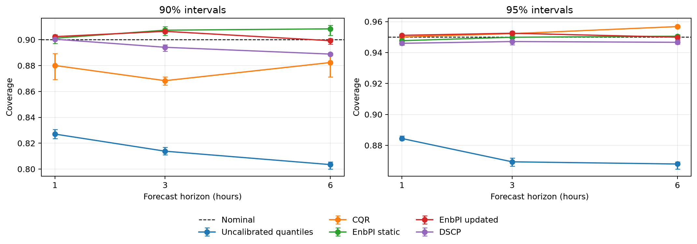

# BDG2 fold-2 interval methods across five training seeds

All **150/150** authorized cells are complete: 30 per seed for seeds 42–46. The four new seeds contributed **120** cells, **204** learned-estimator fits, four DSCP calibrators, 20 KMeans candidate fits, 120 alert streams, and zero matched-forecasting or seasonal-baseline refits. Independent validation and forbidden-fit resume passed for every seed.

The same ten buildings and test periods are reused across seeds. Standard deviations and ranges below describe training-seed variability; they are not population uncertainty, confidence intervals or significance tests.

| horizon | level | method | coverage mean [range] | MPIW mean [range] | Winkler mean [range] |
|---:|---:|---|---:|---:|---:|
| 1 | 0.90 | CQR | 0.8801 [0.8693, 0.8892] | 72.34 [71.65, 72.97] | 118.59 [117.64, 120.66] |
| 1 | 0.90 | DSCP | 0.9004 [0.8992, 0.9015] | 82.74 [82.31, 83.23] | 151.74 [151.02, 152.43] |
| 1 | 0.90 | Uncalibrated quantiles | 0.8270 [0.8236, 0.8306] | 67.96 [67.16, 68.45] | 119.91 [118.83, 122.29] |
| 1 | 0.90 | EnbPI static | 0.9011 [0.8971, 0.9038] | 102.23 [99.66, 104.90] | 184.83 [183.89, 186.36] |
| 1 | 0.90 | EnbPI updated | 0.9024 [0.9019, 0.9034] | 85.74 [85.20, 86.96] | 134.24 [133.70, 135.31] |
| 1 | 0.95 | CQR | 0.9501 [0.9497, 0.9504] | 98.29 [97.84, 98.72] | 153.47 [152.31, 154.44] |
| 1 | 0.95 | DSCP | 0.9460 [0.9450, 0.9469] | 115.55 [114.61, 116.29] | 202.54 [201.59, 203.14] |
| 1 | 0.95 | Uncalibrated quantiles | 0.8844 [0.8833, 0.8862] | 89.30 [88.51, 89.84] | 155.88 [154.58, 156.62] |
| 1 | 0.95 | EnbPI static | 0.9477 [0.9449, 0.9507] | 146.31 [142.46, 149.61] | 247.97 [246.34, 249.98] |
| 1 | 0.95 | EnbPI updated | 0.9511 [0.9507, 0.9517] | 117.56 [117.02, 117.89] | 169.35 [168.80, 170.27] |
| 3 | 0.90 | CQR | 0.8683 [0.8650, 0.8713] | 104.97 [103.87, 106.00] | 172.02 [170.22, 173.27] |
| 3 | 0.90 | DSCP | 0.8941 [0.8910, 0.8960] | 124.41 [120.92, 125.91] | 235.94 [227.72, 238.61] |
| 3 | 0.90 | Uncalibrated quantiles | 0.8138 [0.8112, 0.8167] | 98.37 [97.46, 99.37] | 174.55 [172.66, 176.11] |
| 3 | 0.90 | EnbPI static | 0.9073 [0.9033, 0.9101] | 157.16 [152.77, 161.32] | 273.30 [271.76, 274.29] |
| 3 | 0.90 | EnbPI updated | 0.9065 [0.9050, 0.9086] | 131.87 [131.62, 132.19] | 196.60 [195.75, 197.14] |
| 3 | 0.95 | CQR | 0.9522 [0.9513, 0.9538] | 139.04 [137.88, 140.54] | 217.21 [216.54, 217.78] |
| 3 | 0.95 | DSCP | 0.9471 [0.9451, 0.9492] | 182.61 [175.96, 185.20] | 316.87 [306.40, 320.24] |
| 3 | 0.95 | Uncalibrated quantiles | 0.8694 [0.8665, 0.8718] | 122.95 [121.33, 124.55] | 223.24 [222.19, 224.42] |
| 3 | 0.95 | EnbPI static | 0.9499 [0.9474, 0.9517] | 222.15 [215.87, 228.88] | 367.62 [365.26, 368.96] |
| 3 | 0.95 | EnbPI updated | 0.9525 [0.9517, 0.9533] | 172.83 [172.38, 173.63] | 245.72 [244.77, 246.45] |
| 6 | 0.90 | CQR | 0.8824 [0.8711, 0.8881] | 126.89 [125.47, 128.68] | 210.18 [209.56, 210.98] |
| 6 | 0.90 | DSCP | 0.8889 [0.8881, 0.8895] | 146.23 [145.83, 146.73] | 292.23 [291.22, 292.89] |
| 6 | 0.90 | Uncalibrated quantiles | 0.8034 [0.8001, 0.8055] | 115.94 [114.89, 116.99] | 214.07 [213.56, 214.52] |
| 6 | 0.90 | EnbPI static | 0.9084 [0.9034, 0.9111] | 190.50 [184.10, 195.77] | 332.10 [330.39, 334.08] |
| 6 | 0.90 | EnbPI updated | 0.8992 [0.8966, 0.9008] | 158.37 [157.90, 158.82] | 239.27 [237.63, 240.62] |
| 6 | 0.95 | CQR | 0.9568 [0.9560, 0.9576] | 174.36 [172.44, 176.01] | 270.51 [268.32, 272.31] |
| 6 | 0.95 | DSCP | 0.9466 [0.9454, 0.9485] | 222.77 [220.13, 224.60] | 396.88 [393.78, 397.93] |
| 6 | 0.95 | Uncalibrated quantiles | 0.8680 [0.8647, 0.8692] | 146.91 [145.61, 148.71] | 276.92 [273.75, 278.95] |
| 6 | 0.95 | EnbPI static | 0.9505 [0.9469, 0.9516] | 273.77 [264.13, 279.67] | 449.04 [445.92, 452.35] |
| 6 | 0.95 | EnbPI updated | 0.9499 [0.9480, 0.9513] | 209.68 [208.61, 211.38] | 298.26 [296.04, 299.97] |

Across the six horizon/level settings, the five-seed mean CQR coverage gain over its shared raw-quantile owner ranged from 5.30 to 8.88 percentage points. CQR reduced absolute nominal-coverage error in 6/6 settings on average and its mean Winkler difference ranged from -6.41 to -1.32 kWh.

Updated EnbPI changed mean coverage by -0.92 to 0.35 percentage points versus its shared static owner. Its mean interval width difference ranged from -64.09 to -16.50 kWh and mean Winkler difference from -150.78 to -50.59 kWh.

Across the 150 pooled combined-channel cells, clean-stream background episodes ranged from 584 to 3,737 per cell (0.4046 to 2.5891 episodes per asset-day), and time in alert ranged from 0.0424 to 0.2000. All rows were available and availability-only alerts were zero. The event catalogue was empty, so these results cannot estimate recall, F1, detection delay, confirmed false-alarm rates or operational feasibility. Native and common-support views describe the same 150 cells and are not double-counted.

The four new runs used 4,335.26 worker-seconds, independent validation 3,737.09, and completed resumes 14.81; all twelve exits were 0. Total measured worker time was 8,087.16 seconds (7,886.44 CPU seconds), and peak lifetime RSS was 0.967 GiB.

## Evidence and remaining work

[Five-seed metrics](smart_building_conformal/outputs/matched_intervals005/bdg2_fold2_multiseed_v2_coordinator/analysis_v1/five_seed_summary.csv), [per-seed common metrics](smart_building_conformal/outputs/matched_intervals005/bdg2_fold2_multiseed_v2_coordinator/analysis_v1/common_support_metrics.csv), [background workload](smart_building_conformal/outputs/matched_intervals005/bdg2_fold2_multiseed_v2_coordinator/analysis_v1/background_workload.csv), [worker costs](smart_building_conformal/outputs/matched_intervals005/bdg2_fold2_multiseed_v2_coordinator/analysis_v1/worker_costs.csv), and the [evidence index](review/matched_intervals005_bdg2_multiseed_20260914/EVIDENCE_INDEX.md) are recomputable.

Matched forecasting remains **70/195**. Interval methods are **150/1950**, leaving **1,800** cells. The three deterministic seasonal computations remain three; the four new seeds add twelve point and 24 interval aliases, not computations. Full-study readiness remains false.

The next bounded execution proposal is PLEIA-energy outer fold 1, seed 42, horizons 1/3/6: three matched-forecasting units, 30 learned-fit invocations, nine point cells and eighteen own-model split-conformal interval cells. The corresponding completed fold-2 workers are the direct measured cost basis; fitting-row-scaled run time totals approximately 403.5 seconds. This is a scheduling estimate rather than an authorization or runtime guarantee. The exact commands and costs are saved in `next_proposed_forecasting_units.csv` and `next_proposed_measured_costs.csv`; none were launched.
