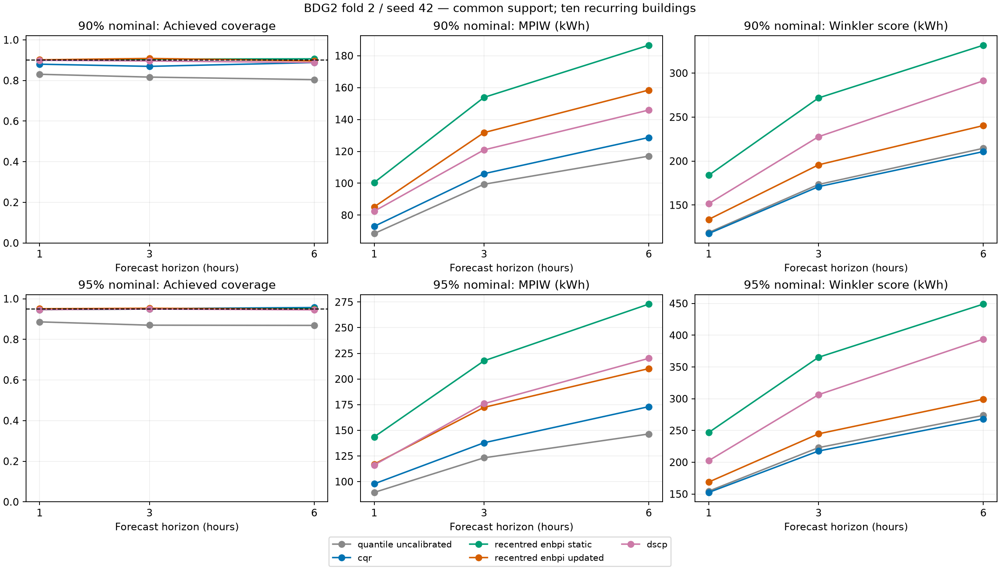
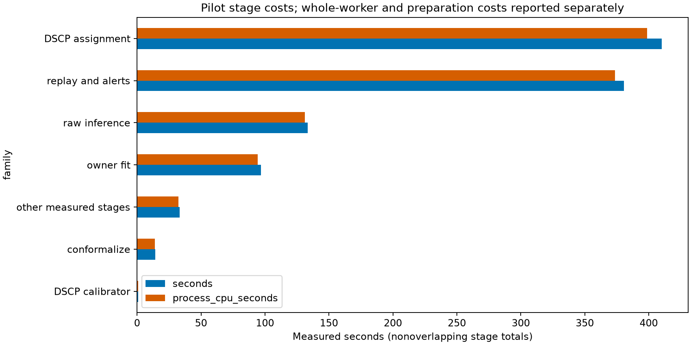

# BDG2 matched interval-method pilot

All **30 method cells**, **three seasonal point cells and six seasonal interval cells**, and **30 clean-stream alert-consumption checks** completed and passed independent validation. Completed resume forbade learned and calibrator fitting and preserved every scientific run file. Matched forecasting remains **70/195**; interval methods now have **30/1950** completed cells. Full-study readiness remains false.

Evaluated scientific source SHA-256: `026da0df7a10396c455a6a8d28a2736532e9a439a61e38ddea04d830bd142f19`. Historical matched XGBoost owners retain `cd907183301a189ddfcc195774dad58c8fa07d5b326d2ac29cf3636383dc681e`. Native single-horizon targets are preserved; common comparisons use exactly **34,590 joint origins per horizon** across ten buildings, with **17,270 calibration origins** and **51,534 fit-role origins**. The latter does not replace any direct model's original training support.

## Observed calibration and updating effects

**CQR versus its shared uncalibrated quantiles:** across the six horizon/level combinations, coverage changed by +4.967 to +8.800 percentage points. Absolute distance from nominal coverage decreased in 6/6 combinations. MPIW changed by +4.519 to +26.611 kWh, while Winkler changed by -5.434 to -1.191 kWh; Winkler was lower in 6/6 combinations. These are descriptive paired differences on common support, with no independence or significance claim.

**Updated versus static recentred EnbPI:** across the six horizon/level combinations, coverage changed by -0.989 to +0.457 percentage points. Absolute distance from nominal coverage decreased in 2/6 combinations. MPIW changed by -62.842 to -15.253 kWh, while Winkler changed by -149.681 to -50.152 kWh; Winkler was lower in 6/6 combinations. These are descriptive paired differences on common support, with no independence or significance claim.

DSCP achieved 88.870% to 94.923% coverage across the six cells. Its interval owner uses the existing matched XGBoost predictions, so differences from the quantile and EnbPI methods include predictor differences. All reported widths and scores are evaluated on the same 34,590 common origins per horizon.

DSCP selected **3 calibration clusters**, with sizes [1964, 6895, 8411] and **1964 neighbours** under the frozen smallest-cluster rule. The first 64 assignments took 0.738603 seconds and were reused in the full cohort. [Calibration and bounded-assignment details](smart_building_conformal/outputs/matched_intervals005/bdg2_pilot_v1_coordinator/analysis_v1/dscp_calibration_summary.json) retain the legacy implementation attribution as a historical label, not a new claim about current code availability.

**Validation correction:** the first validator exited 1 because it assumed symmetric max-score CQR correction. The evaluated native MAPIE generator used its installed default asymmetric tail corrections. All six native cells reconstructed exactly after correcting the validator. The original protocol, owners and all issued bounds are preserved; [the explicit erratum](review/matched_intervals005_bdg2_20260914/VALIDATION_ERRATUM.md) pins both source identities and limits historical reuse to no-fit validation/completed resume. The second validator exited 1 because its EnbPI OOB average retained float32, whereas MAPIE accumulates float64. All three reconstructed OOB score arrays match exactly with the native dtype. [The precision erratum](review/matched_intervals005_bdg2_20260914/VALIDATION_ERRATUM_V3.md) records the unchanged tolerances and outputs. The third validator exited 1 after adding offsets to float32 point CSV decimals read as float64; reconstruction from actual reloaded points passes all six native EnbPI cells, and restoring the cached points to float32 recovers them exactly. [The final precision record](review/matched_intervals005_bdg2_20260914/VALIDATION_ERRATUM_V4.md) documents this without changing data or tolerances. The fourth validator completed all first-horizon checks before a missing gc import stopped cleanup. [The cleanup record](review/matched_intervals005_bdg2_20260914/VALIDATION_ERRATUM_V5.md) documents its repair. The fifth independent validation and completed resume passed. Failed validation costs remain separate in the cost CSV.

## Common-support numerical comparison

| horizon | level | method | n | coverage | mpiw | winkler | mae | rmse |
| --- | --- | --- | --- | --- | --- | --- | --- | --- |
| 1 | 0.9 | quantile_uncalibrated | 34590 | 0.830587 | 68.4462 | 118.83 | 17.246 | 35.6771 |
| 1 | 0.9 | cqr | 34590 | 0.880254 | 72.9655 | 117.639 | 17.246 | 35.6771 |
| 1 | 0.9 | recentred_enbpi_static | 34590 | 0.899364 | 100.452 | 183.89 | 23.0223 | 38.3731 |
| 1 | 0.9 | recentred_enbpi_updated | 34590 | 0.90185 | 85.1984 | 133.739 | 23.0223 | 38.3731 |
| 1 | 0.9 | dscp | 34590 | 0.899595 | 82.4614 | 151.656 | 17.7614 | 34.9751 |
| 1 | 0.95 | quantile_uncalibrated | 34590 | 0.886152 | 89.4764 | 154.581 | 17.246 | 35.6771 |
| 1 | 0.95 | cqr | 34590 | 0.949957 | 97.8401 | 152.502 | 17.246 | 35.6771 |
| 1 | 0.95 | recentred_enbpi_static | 34590 | 0.946083 | 143.602 | 246.891 | 23.0223 | 38.3731 |
| 1 | 0.95 | recentred_enbpi_updated | 34590 | 0.95065 | 117.022 | 168.869 | 23.0223 | 38.3731 |
| 1 | 0.95 | dscp | 34590 | 0.946285 | 116.16 | 202.52 | 17.7614 | 34.9751 |
| 3 | 0.9 | quantile_uncalibrated | 34590 | 0.816739 | 99.3672 | 173.433 | 26.3214 | 54.5325 |
| 3 | 0.9 | cqr | 34590 | 0.869615 | 105.996 | 170.947 | 26.3214 | 54.5325 |
| 3 | 0.9 | recentred_enbpi_static | 34590 | 0.905146 | 153.854 | 271.76 | 32.0193 | 55.9983 |
| 3 | 0.9 | recentred_enbpi_updated | 34590 | 0.908557 | 131.751 | 195.754 | 32.0193 | 55.9983 |
| 3 | 0.9 | dscp | 34590 | 0.895981 | 120.918 | 227.721 | 26.968 | 52.116 |
| 3 | 0.95 | quantile_uncalibrated | 34590 | 0.869905 | 123.208 | 223.062 | 26.3214 | 54.5325 |
| 3 | 0.95 | cqr | 34590 | 0.951373 | 137.879 | 217.718 | 26.3214 | 54.5325 |
| 3 | 0.95 | recentred_enbpi_static | 34590 | 0.949292 | 217.72 | 365.264 | 32.0193 | 55.9983 |
| 3 | 0.95 | recentred_enbpi_updated | 34590 | 0.95331 | 172.382 | 244.772 | 32.0193 | 55.9983 |
| 3 | 0.95 | dscp | 34590 | 0.949234 | 175.962 | 306.399 | 26.968 | 52.116 |
| 6 | 0.9 | quantile_uncalibrated | 34590 | 0.804192 | 116.992 | 214.517 | 32.1351 | 69.109 |
| 6 | 0.9 | cqr | 34590 | 0.888147 | 128.684 | 210.758 | 32.1351 | 69.109 |
| 6 | 0.9 | recentred_enbpi_static | 34590 | 0.906534 | 186.57 | 331.666 | 37.8666 | 69.0732 |
| 6 | 0.9 | recentred_enbpi_updated | 34590 | 0.896646 | 158.436 | 240.347 | 37.8666 | 69.0732 |
| 6 | 0.9 | dscp | 34590 | 0.888696 | 145.908 | 291.22 | 34.1525 | 66.7862 |
| 6 | 0.95 | quantile_uncalibrated | 34590 | 0.868777 | 146.434 | 273.753 | 32.1351 | 69.109 |
| 6 | 0.95 | cqr | 34590 | 0.956779 | 173.045 | 268.318 | 32.1351 | 69.109 |
| 6 | 0.95 | recentred_enbpi_static | 34590 | 0.9512 | 272.982 | 448.949 | 37.8666 | 69.0732 |
| 6 | 0.95 | recentred_enbpi_updated | 34590 | 0.947962 | 210.14 | 299.268 | 37.8666 | 69.0732 |
| 6 | 0.95 | dscp | 34590 | 0.945447 | 220.134 | 393.783 | 34.1525 | 66.7862 |

[Native-support figure](smart_building_conformal/outputs/matched_intervals005/bdg2_pilot_v1_coordinator/analysis_v1/figures/native_interval_quality.png) is separate because native single-horizon supports differ from the joint-origin cohort. Both figures have PDF exports and exact CSV/source hashes in the evidence index.

[Native-support metrics](smart_building_conformal/outputs/matched_intervals005/bdg2_pilot_v1_coordinator/analysis_v1/native_support_metrics.csv), [common-support metrics](smart_building_conformal/outputs/matched_intervals005/bdg2_pilot_v1_coordinator/analysis_v1/common_support_metrics.csv), [per-building contributions](smart_building_conformal/outputs/matched_intervals005/bdg2_pilot_v1_coordinator/analysis_v1/per_building_metrics.csv), and [shared-owner contrasts](smart_building_conformal/outputs/matched_intervals005/bdg2_pilot_v1_coordinator/analysis_v1/shared_owner_contrasts.csv) expose every result, without selecting favorable settings.

Raw bound crossings remain explicit below. Shared-owner consumers can show the same crossing rows twice; these are not distinct predictor failures. The frozen policy orders emitted bounds while retaining each raw pair.

| horizon | level | method | n | raw_crossed |
| --- | --- | --- | --- | --- |
| 6 | 0.9 | quantile_uncalibrated | 34640 | 4 |
| 6 | 0.9 | cqr | 34640 | 4 |

## Shared-owner calibration and updating

| horizon | level | left_method | right_method | coverage_difference | mpiw_difference | winkler_difference |
| --- | --- | --- | --- | --- | --- | --- |
| 1 | 0.9 | cqr | quantile_uncalibrated | 0.0496675 | 4.51929 | -1.19116 |
| 1 | 0.9 | recentred_enbpi_updated | recentred_enbpi_static | 0.00248627 | -15.2533 | -50.1516 |
| 1 | 0.95 | cqr | quantile_uncalibrated | 0.0638046 | 8.36374 | -2.07904 |
| 1 | 0.95 | recentred_enbpi_updated | recentred_enbpi_static | 0.00456779 | -26.5799 | -78.0216 |
| 3 | 0.9 | cqr | quantile_uncalibrated | 0.0528766 | 6.62838 | -2.48611 |
| 3 | 0.9 | recentred_enbpi_updated | recentred_enbpi_static | 0.00341139 | -22.1028 | -76.006 |
| 3 | 0.95 | cqr | quantile_uncalibrated | 0.0814686 | 14.6717 | -5.34437 |
| 3 | 0.95 | recentred_enbpi_updated | recentred_enbpi_static | 0.0040185 | -45.3375 | -120.492 |
| 6 | 0.9 | cqr | quantile_uncalibrated | 0.0839549 | 11.6918 | -3.75953 |
| 6 | 0.9 | recentred_enbpi_updated | recentred_enbpi_static | -0.00988725 | -28.134 | -91.319 |
| 6 | 0.95 | cqr | quantile_uncalibrated | 0.0880023 | 26.6109 | -5.43447 |
| 6 | 0.95 | recentred_enbpi_updated | recentred_enbpi_static | -0.00323793 | -62.8419 | -149.681 |

Differences are left minus right. CQR/uncalibrated share the same fitted quantile owner, so that pair isolates its conformal correction. Static/updated EnbPI share the same calibrated ensemble, but the updated policy uses amendment-004 delayed signed-score ranks and original-group/segment state; it is explicitly distinct from the legacy interpolated updated policy. Across all five methods, predictor owners differ: this is not a pure calibrator-only comparison. Narrower width alone is not a benefit without achieved coverage and Winkler context.

The installed five-bootstrap EnbPI construction leaves some calibration rows without an out-of-bag prediction. Their nonfinite conformity scores are retained in the saved owner and recorded in [calibration support](smart_building_conformal/outputs/matched_intervals005/bdg2_pilot_v1_coordinator/analysis_v1/enbpi_calibration_support.csv). Native quantiles use finite scores under the installed convention; independent validation reconstructs these scores from the saved bootstrap estimators and masks. No test row was removed and the frozen bootstrap count was unchanged.

| horizon | calibration_rows | finite_oob_scores | nonfinite_oob_scores | fraction_nonfinite |
| --- | --- | --- | --- | --- |
| 1 | 17370 | 15580 | 1790 | 0.103051 |
| 3 | 17360 | 15567 | 1793 | 0.103283 |
| 6 | 17350 | 15557 | 1793 | 0.103343 |

## Deterministic seasonal reference

The 24-hour seasonal predictor uses the same matched target rows and its own pre-test absolute residuals for 90%/95% split-conformal intervals. These three point and six interval cells are separate from the method matrix.

| horizon | level | n | mae | rmse | coverage | mpiw | winkler |
| --- | --- | --- | --- | --- | --- | --- | --- |
| 1 | 0.9 | 34640 | 42.5581 | 93.1433 | 0.912327 | 258.186 | 467.556 |
| 1 | 0.95 | 34640 | 42.5581 | 93.1433 | 0.953233 | 369.126 | 644.887 |
| 3 | 0.9 | 34640 | 42.5547 | 93.1404 | 0.912298 | 258.144 | 467.551 |
| 3 | 0.95 | 34640 | 42.5547 | 93.1404 | 0.952685 | 367.6 | 644.795 |
| 6 | 0.9 | 34640 | 42.5418 | 93.1329 | 0.912269 | 258 | 467.533 |
| 6 | 0.95 | 34640 | 42.5418 | 93.1329 | 0.952656 | 367.5 | 644.79 |

## Background alert consumption

All 30 streams use the fixed **immediate single-sample** rule at hourly frequency and an empty event catalogue. Emitted and consumed bounds/availability match exactly. Numerical-only, availability-only and combined episode counts and exposure denominators appear in [background workload](smart_building_conformal/outputs/matched_intervals005/bdg2_pilot_v1_coordinator/analysis_v1/background_workload.csv). These are background episodes, not confirmed false alarms. Recall, F1, delay and primary operational feasibility are not estimable here. Source-marked missing readings remain unavailable even when preprocessing supplies finite values.

| horizon | level | method | channel | exposure_asset_days | episodes | background_episodes_per_asset_day |
| --- | --- | --- | --- | --- | --- | --- |
| 1 | 0.9 | quantile_uncalibrated | numerical_only | 1443.33 | 3641 | 2.52263 |
| 1 | 0.9 | quantile_uncalibrated | availability_only | 1443.33 | 0 | 0 |
| 1 | 0.9 | quantile_uncalibrated | combined | 1443.33 | 3641 | 2.52263 |
| 1 | 0.9 | cqr | numerical_only | 1443.33 | 2676 | 1.85404 |
| 1 | 0.9 | cqr | availability_only | 1443.33 | 0 | 0 |
| 1 | 0.9 | cqr | combined | 1443.33 | 2676 | 1.85404 |
| 1 | 0.9 | recentred_enbpi_static | numerical_only | 1443.33 | 2282 | 1.58106 |
| 1 | 0.9 | recentred_enbpi_static | availability_only | 1443.33 | 0 | 0 |
| 1 | 0.9 | recentred_enbpi_static | combined | 1443.33 | 2282 | 1.58106 |
| 1 | 0.9 | recentred_enbpi_updated | numerical_only | 1443.33 | 2300 | 1.59353 |
| 1 | 0.9 | recentred_enbpi_updated | availability_only | 1443.33 | 0 | 0 |
| 1 | 0.9 | recentred_enbpi_updated | combined | 1443.33 | 2300 | 1.59353 |
| 1 | 0.9 | dscp | numerical_only | 1441.25 | 2310 | 1.60278 |
| 1 | 0.9 | dscp | availability_only | 1441.25 | 0 | 0 |
| 1 | 0.9 | dscp | combined | 1441.25 | 2310 | 1.60278 |
| 1 | 0.95 | quantile_uncalibrated | numerical_only | 1443.33 | 2326 | 1.61155 |
| 1 | 0.95 | quantile_uncalibrated | availability_only | 1443.33 | 0 | 0 |
| 1 | 0.95 | quantile_uncalibrated | combined | 1443.33 | 2326 | 1.61155 |
| 1 | 0.95 | cqr | numerical_only | 1443.33 | 1547 | 1.07182 |
| 1 | 0.95 | cqr | availability_only | 1443.33 | 0 | 0 |
| 1 | 0.95 | cqr | combined | 1443.33 | 1547 | 1.07182 |
| 1 | 0.95 | recentred_enbpi_static | numerical_only | 1443.33 | 1395 | 0.966513 |
| 1 | 0.95 | recentred_enbpi_static | availability_only | 1443.33 | 0 | 0 |
| 1 | 0.95 | recentred_enbpi_static | combined | 1443.33 | 1395 | 0.966513 |
| 1 | 0.95 | recentred_enbpi_updated | numerical_only | 1443.33 | 1326 | 0.918707 |
| 1 | 0.95 | recentred_enbpi_updated | availability_only | 1443.33 | 0 | 0 |
| 1 | 0.95 | recentred_enbpi_updated | combined | 1443.33 | 1326 | 0.918707 |
| 1 | 0.95 | dscp | numerical_only | 1441.25 | 1407 | 0.976236 |
| 1 | 0.95 | dscp | availability_only | 1441.25 | 0 | 0 |
| 1 | 0.95 | dscp | combined | 1441.25 | 1407 | 0.976236 |
| 3 | 0.9 | quantile_uncalibrated | numerical_only | 1443.33 | 2655 | 1.83949 |
| 3 | 0.9 | quantile_uncalibrated | availability_only | 1443.33 | 0 | 0 |
| 3 | 0.9 | quantile_uncalibrated | combined | 1443.33 | 2655 | 1.83949 |
| 3 | 0.9 | cqr | numerical_only | 1443.33 | 1835 | 1.27136 |
| 3 | 0.9 | cqr | availability_only | 1443.33 | 0 | 0 |
| 3 | 0.9 | cqr | combined | 1443.33 | 1835 | 1.27136 |
| 3 | 0.9 | recentred_enbpi_static | numerical_only | 1443.33 | 1444 | 1.00046 |
| 3 | 0.9 | recentred_enbpi_static | availability_only | 1443.33 | 0 | 0 |
| 3 | 0.9 | recentred_enbpi_static | combined | 1443.33 | 1444 | 1.00046 |
| 3 | 0.9 | recentred_enbpi_updated | numerical_only | 1443.33 | 1476 | 1.02263 |
| 3 | 0.9 | recentred_enbpi_updated | availability_only | 1443.33 | 0 | 0 |
| 3 | 0.9 | recentred_enbpi_updated | combined | 1443.33 | 1476 | 1.02263 |
| 3 | 0.9 | dscp | numerical_only | 1441.25 | 1636 | 1.13513 |
| 3 | 0.9 | dscp | availability_only | 1441.25 | 0 | 0 |
| 3 | 0.9 | dscp | combined | 1441.25 | 1636 | 1.13513 |
| 3 | 0.95 | quantile_uncalibrated | numerical_only | 1443.33 | 1720 | 1.19169 |
| 3 | 0.95 | quantile_uncalibrated | availability_only | 1443.33 | 0 | 0 |
| 3 | 0.95 | quantile_uncalibrated | combined | 1443.33 | 1720 | 1.19169 |
| 3 | 0.95 | cqr | numerical_only | 1443.33 | 985 | 0.682448 |
| 3 | 0.95 | cqr | availability_only | 1443.33 | 0 | 0 |
| 3 | 0.95 | cqr | combined | 1443.33 | 985 | 0.682448 |
| 3 | 0.95 | recentred_enbpi_static | numerical_only | 1443.33 | 818 | 0.566744 |
| 3 | 0.95 | recentred_enbpi_static | availability_only | 1443.33 | 0 | 0 |
| 3 | 0.95 | recentred_enbpi_static | combined | 1443.33 | 818 | 0.566744 |
| 3 | 0.95 | recentred_enbpi_updated | numerical_only | 1443.33 | 778 | 0.53903 |
| 3 | 0.95 | recentred_enbpi_updated | availability_only | 1443.33 | 0 | 0 |
| 3 | 0.95 | recentred_enbpi_updated | combined | 1443.33 | 778 | 0.53903 |
| 3 | 0.95 | dscp | numerical_only | 1441.25 | 858 | 0.595317 |
| 3 | 0.95 | dscp | availability_only | 1441.25 | 0 | 0 |
| 3 | 0.95 | dscp | combined | 1441.25 | 858 | 0.595317 |
| 6 | 0.9 | quantile_uncalibrated | numerical_only | 1443.33 | 2346 | 1.6254 |
| 6 | 0.9 | quantile_uncalibrated | availability_only | 1443.33 | 0 | 0 |
| 6 | 0.9 | quantile_uncalibrated | combined | 1443.33 | 2346 | 1.6254 |
| 6 | 0.9 | cqr | numerical_only | 1443.33 | 1506 | 1.04342 |
| 6 | 0.9 | cqr | availability_only | 1443.33 | 0 | 0 |
| 6 | 0.9 | cqr | combined | 1443.33 | 1506 | 1.04342 |
| 6 | 0.9 | recentred_enbpi_static | numerical_only | 1443.33 | 1137 | 0.78776 |
| 6 | 0.9 | recentred_enbpi_static | availability_only | 1443.33 | 0 | 0 |
| 6 | 0.9 | recentred_enbpi_static | combined | 1443.33 | 1137 | 0.78776 |
| 6 | 0.9 | recentred_enbpi_updated | numerical_only | 1443.33 | 1146 | 0.793995 |
| 6 | 0.9 | recentred_enbpi_updated | availability_only | 1443.33 | 0 | 0 |
| 6 | 0.9 | recentred_enbpi_updated | combined | 1443.33 | 1146 | 0.793995 |
| 6 | 0.9 | dscp | numerical_only | 1441.25 | 1353 | 0.938768 |
| 6 | 0.9 | dscp | availability_only | 1441.25 | 0 | 0 |
| 6 | 0.9 | dscp | combined | 1441.25 | 1353 | 0.938768 |
| 6 | 0.95 | quantile_uncalibrated | numerical_only | 1443.33 | 1494 | 1.0351 |
| 6 | 0.95 | quantile_uncalibrated | availability_only | 1443.33 | 0 | 0 |
| 6 | 0.95 | quantile_uncalibrated | combined | 1443.33 | 1494 | 1.0351 |
| 6 | 0.95 | cqr | numerical_only | 1443.33 | 729 | 0.505081 |
| 6 | 0.95 | cqr | availability_only | 1443.33 | 0 | 0 |
| 6 | 0.95 | cqr | combined | 1443.33 | 729 | 0.505081 |
| 6 | 0.95 | recentred_enbpi_static | numerical_only | 1443.33 | 626 | 0.433718 |
| 6 | 0.95 | recentred_enbpi_static | availability_only | 1443.33 | 0 | 0 |
| 6 | 0.95 | recentred_enbpi_static | combined | 1443.33 | 626 | 0.433718 |
| 6 | 0.95 | recentred_enbpi_updated | numerical_only | 1443.33 | 608 | 0.421247 |
| 6 | 0.95 | recentred_enbpi_updated | availability_only | 1443.33 | 0 | 0 |
| 6 | 0.95 | recentred_enbpi_updated | combined | 1443.33 | 608 | 0.421247 |
| 6 | 0.95 | dscp | numerical_only | 1441.25 | 728 | 0.505117 |
| 6 | 0.95 | dscp | availability_only | 1441.25 | 0 | 0 |
| 6 | 0.95 | dscp | combined | 1441.25 | 728 | 0.505117 |

## Actual fitting and computational cost

Six CQR wrappers trained **18 quantile estimators**. Three EnbPI wrappers made **33 XGBoost estimator fits**: each native factory invocation includes one full-training estimator, five training bootstrap fits and five calibration bootstrap fits during explicit conformalization. The trained calibration-bootstrap ensemble is shared by both levels and static/updated consumers; the original full-training predictor remains the recentring point owner. These 51 learned fits do not include any new matched-XGBoost or LSTM fit. One DSCP calibrator evaluated five KMeans candidates using calibration data only. Wrapper/calibrator calls are separate ledger categories, not additional learned-estimator counts.

| action | actual_exit | seconds | process_cpu_seconds | peak_rss_bytes | lifetime_peak_rss_bytes |
| --- | --- | --- | --- | --- | --- |
| run | 0 | 1139.5 | 1099.86 | 978305024 | 1035694080 |
| validate | 0 | 957.393 | 933.594 | 960634880 | 1036623872 |
| resume | 0 | 3.83296 | 3.79688 | 329445376 | 329445376 |

[Whole-worker costs](smart_building_conformal/outputs/matched_intervals005/bdg2_pilot_v1_coordinator/analysis_v1/worker_costs.csv), [nonoverlapping stage costs](smart_building_conformal/outputs/matched_intervals005/bdg2_pilot_v1_coordinator/analysis_v1/stage_costs.csv), [preparation costs](smart_building_conformal/outputs/matched_intervals005/bdg2_pilot_v1_coordinator/analysis_v1/preparation_costs.csv), and [actual nested operations](smart_building_conformal/outputs/matched_intervals005/bdg2_pilot_v1_coordinator/analysis_v1/operations.csv) retain their measurement scope. Do not add nested wrapper/base operations to enclosing phase totals or add worker totals again. CPU-only/thread1/n_jobs1 and the nonblocking 3 GiB reference remain unchanged.

Independent validation maximum observed arithmetic/prediction discrepancy was **6.0546875e-05**; [the per-check CSV](smart_building_conformal/outputs/matched_intervals005/bdg2_pilot_v1_coordinator/validation_v5/reconstruction_checks.csv) records each frozen tolerance. All checks passed under their unchanged absolute/relative tolerances. The largest observed difference is from `reload_1_enbpi_0.9_calibration_15872_point`. [Largest discrepancies and their exact tolerances](smart_building_conformal/outputs/matched_intervals005/bdg2_pilot_v1_coordinator/analysis_v1/largest_reconstruction_differences.csv) distinguish point serialization, native bounds and pooled arithmetic.

[Additional integrity checks](smart_building_conformal/outputs/matched_intervals005/bdg2_pilot_v1_coordinator/analysis_v1/additional_integrity_validation.json) independently reconstruct all 990 background-exposure/rate rows and 60 native/common crossing counts, reconcile every started/returned operation, and confirm base-estimator seed 42. They preserve all scientific files and perform no fitting.

## Scope and remaining work

This is one historical fold and one model seed on ten recurring known buildings. It establishes neither population/conditional/simultaneous coverage nor unseen-building portability. DSCP retains its from-paper and direct-horizon adaptation labels. Native and common subsets are two views of the same 30 cells; an online subset retains its original causal history.

**Next scalable proposal:** generalize only the authorization/scope guard and verify seed propagation, then separately authorize BDG2 fold2 /seeds43–46 /horizons1,3,6 /both levels /the same five methods: **120 exact keys** in [next_proposed_method_keys.csv](smart_building_conformal/outputs/matched_intervals005/bdg2_pilot_v1_coordinator/analysis_v1/next_proposed_method_keys.csv). Reuse each seed's existing matched XGBoost objects. Expected additional operations: 24 CQR wrappers/72 quantile fits, 12 EnbPI wrappers/132 XGBoost fits, 4 DSCP calibrators/20 KMeans candidates. Seasonal values are deterministic aliases; no new seasonal computation is needed on unchanged targets. [Measured planning costs](smart_building_conformal/outputs/matched_intervals005/bdg2_pilot_v1_coordinator/analysis_v1/next_proposed_costs.json) scale this pilot and are neither a guarantee nor a confidence interval. This batch is not launched.

Still required: 125 matched forecasting units; 1,920 interval-method cells; 24 unique seasonal computations plus explicit seed aliases; full operational selection, support-limited PLEIA/RICO endpoints and separately labelled conditional contexts; robustness, calibration contamination and recovery/censoring obligations. No threshold, membership, raw meter value, candidate or historical source was changed.
