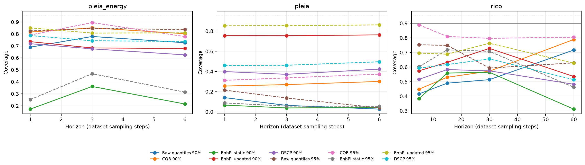

# Matched interval methods: remaining fold-2 seed-42 settings

The authorized PLEIA-energy, PLEIA-temperature and RICO interval-method units are complete. The batch adds **100/100** new interval-method cells: 30 for each PLEIA target and 40 for RICO. With the existing BDG2 seed-42 run, the cross-setting seed-42 comparison contains **130 cells**. Every completed unit passed independent reconstruction and a completed forbidden-fit resume.

Each method uses its own frozen native owner and its own 90%/95% stream. CQR retains its asymmetric native construction, EnbPI updated uses causal maturity-based replay, and DSCP uses only the matched historical XGBoost owners. No matched forecasting owner was refitted and no setting was retuned from outer-test outcomes.

## Coverage, width and score evidence

| dataset | horizons | joint fit / calibration / test origins | frequency | methods × levels |
|---|---|---:|---|---:|
| pleia_energy | 1/3/6 | 14,845 / 4,943 / 9,902 | 0 days 00:10:00 | 30 |
| pleia | 1/3/6 | 14,845 / 4,943 / 9,902 | 0 days 00:10:00 | 30 |
| rico | 5/15/30/60 | 9,577 / 3,297 / 6,437 | 0 days 00:01:00 | 40 |

Exact MAE, RMSE, coverage, MPIW and Winkler rows are in the linked CSVs. The three target panels keep their own scales; they do not support a numerical ranking across temperature and energy targets. Coverage and interval quality describe these fixed test partitions rather than population uncertainty estimates.

## Seasonal baselines and clean-stream alerts

PLEIA energy and temperature each have daily-lag-144 seasonal-naive point baselines for three horizons and twelve split-conformal interval rows in total. RICO has four explicit not-applicable markers because its run segments do not contain a daily cycle; it was not given an invented daily baseline. All streams use original availability masks. The event catalogues are empty, so workload is reported as background episodes and time in alert only; recall, F1, delay and confirmed false-alarm rates are not estimable.

## Computation and completion

The batch recorded 60 quantile-estimator fits and 110 EnbPI XGBoost fits (170 learned fits), plus three DSCP calibrators and 15 KMeans candidate fits. The nine run/validation/resume workers all exited 0. Their measured wall time was 1688.62 seconds, CPU time 1613.62 seconds, and peak worker lifetime RSS 1.162 GiB.

The interval matrix is now **250/1950** complete, leaving **1700** cells. Matched forecasting remains 70/195. This is a bounded evidence update, not full-study completion.

## Next implementation package

Implement the prespecified broader conformal-method and alerting evaluation: add the remaining declared conformal variants and event-backed alert protocol to the supported matched settings, retaining fixed owners, causal observation delay, group isolation, and the frozen matrix. Do not launch it without a separate authorization.
